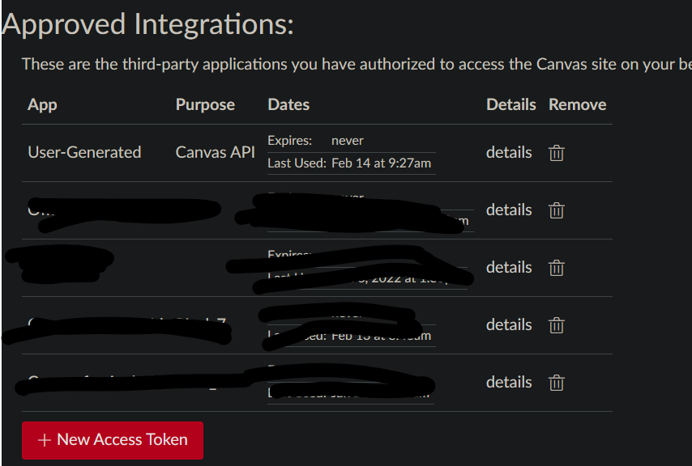

# Project 2

This project is an expansion of what I did in Project 1. Project 1 is a python script that uses the Canvas API to list the names of the courses you have favorited. This project adds the yaml python library to read the Canvas key from a configuration file, so that the authentication token isn't directly entered in the script file

## SETUP

## STEP 1: Install required libraries

To install the requests and pyyaml library type in the following commands:

* `pip install requests`
* `pip install pyyaml`

## STEP 2: Generate your Canvas Token

There are several ways to do this found here: [OAuth2 - Canvas LMS REST API Documentation (instructure.com)](https://canvas.instructure.com/doc/api/file.oauth.html#oauth2-flow-0)

I recommend doing it manually:

    1. Login into your uc.instructure.com account

    2. Go your user settings by clicking on your profile picture in the top left and clicking the word "Settings"

    3. Scroll down until you see "Approved integrations" and click on the "+ New Access Token" button



    4. Enter the Purpose and Expiration date for the token and click "Generate Token"

    5. Then copy the token that gets generated and close the modal

## Step 3: Create your yaml configuration file and enter the Canvas token

1. create a yaml file named `config.yaml` in your project2 folder
2. In your yaml file, write the following code:

```
CANVAS:
	API_KEY:<enter token here>
```

3. Replace "`<enter token here>"` with your Canvas authentication token
4. Run the script with py project2/project2.py
